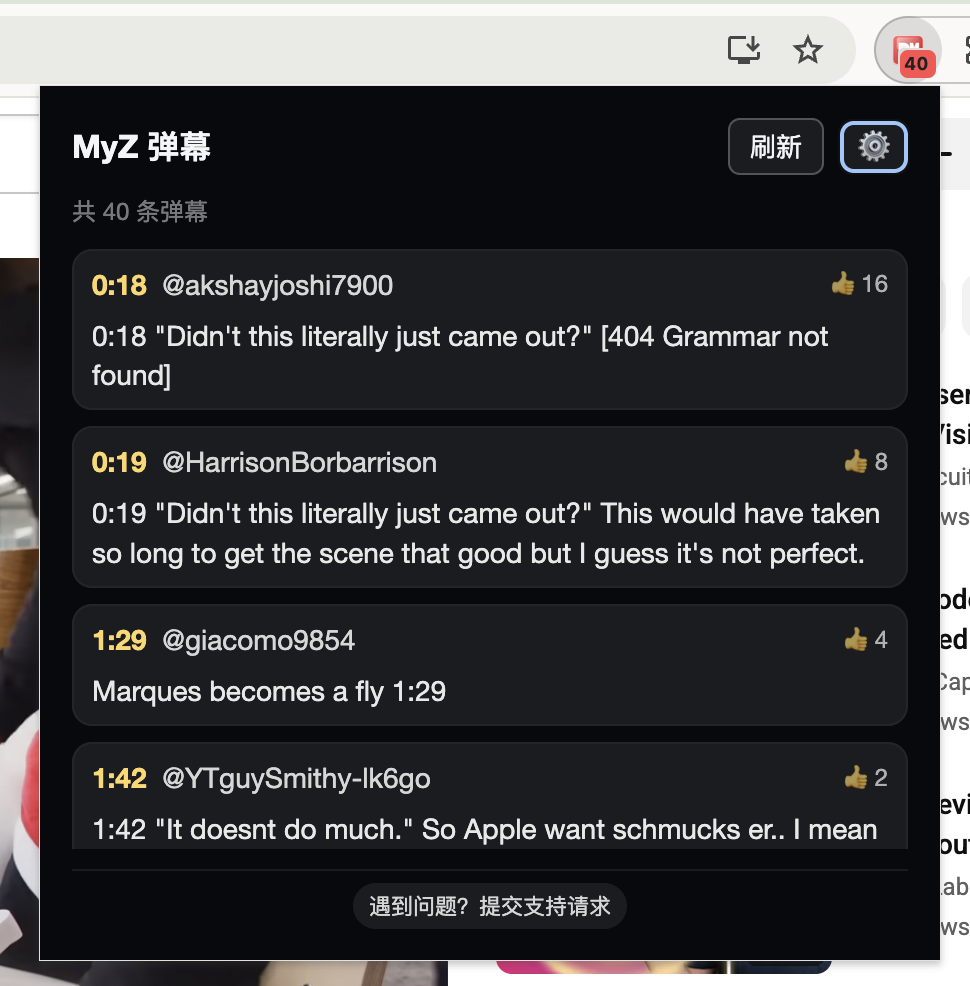
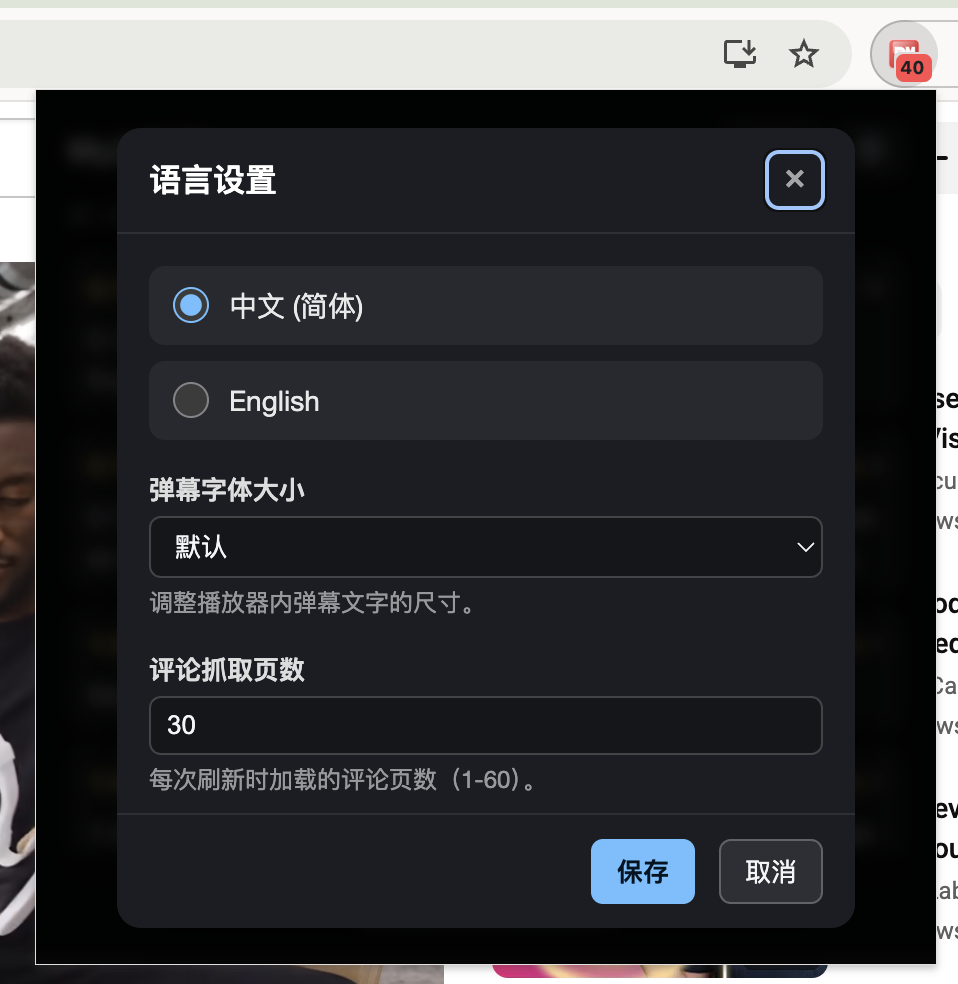

# MyZ 弹幕使用指南

本页面介绍如何安装和使用 MyZ 弹幕 —— 一款专为 YouTube 打造的弹幕扩展。按照下列步骤操作，即可在观看视频时同步读取评论里的时间码内容并将其呈现为弹幕。

## 安装

请通过您浏览器的商店页面进行安装：

- Chrome: <https://chromewebstore.google.com/detail/ignagkboleblnlgpadmpjpccocgpghpa>
- Edge: <https://microsoftedge.microsoft.com/addons/detail/lmeklchkknhmflgjdpemkgdgaceihimk>

## 使用

MyZ 弹幕安装完成后即自动运行，不需要额外启用开关。打开任意 YouTube `watch` 页面即可看到弹幕浮层：

1. **确认加载状态**：播放器控制栏会出现 “弹” 按钮，同时进度条上会显示弹幕位置刻度，代表扩展已成功解析评论。
2. **观看弹幕**：包含时间码的评论会转换成弹幕，按分组顺序在视频顶部滚动展示。

另外，您可以在浏览器扩展列表中找到 MyZ 弹幕。建议点击📌图标将其固定在工具栏，徽标会实时显示当前视频解析到的弹幕数量。

点击图标即可查看详情列表、刷新弹幕或打开设置。

## 设置

点击 Popup 右上角的设置按钮，可调整以下偏好：

- **界面语言**：在中文和英文之间切换。
- **弹幕字体大小**：改变播放器浮层中的文字大小，适配不同屏幕距离。
- **评论抓取页数**：决定每次解析多少页评论（1–60 页）。数值越大可获取更多弹幕，但加载时间也会相应增长。

