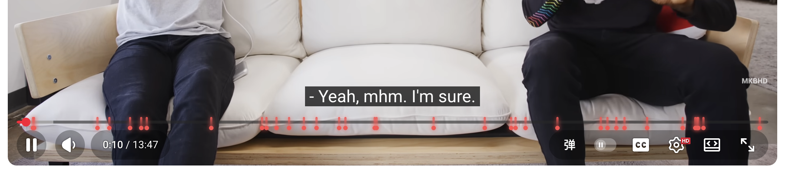
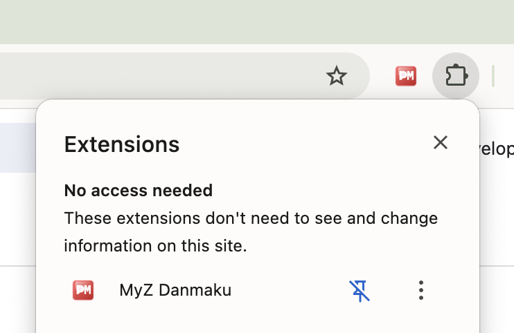
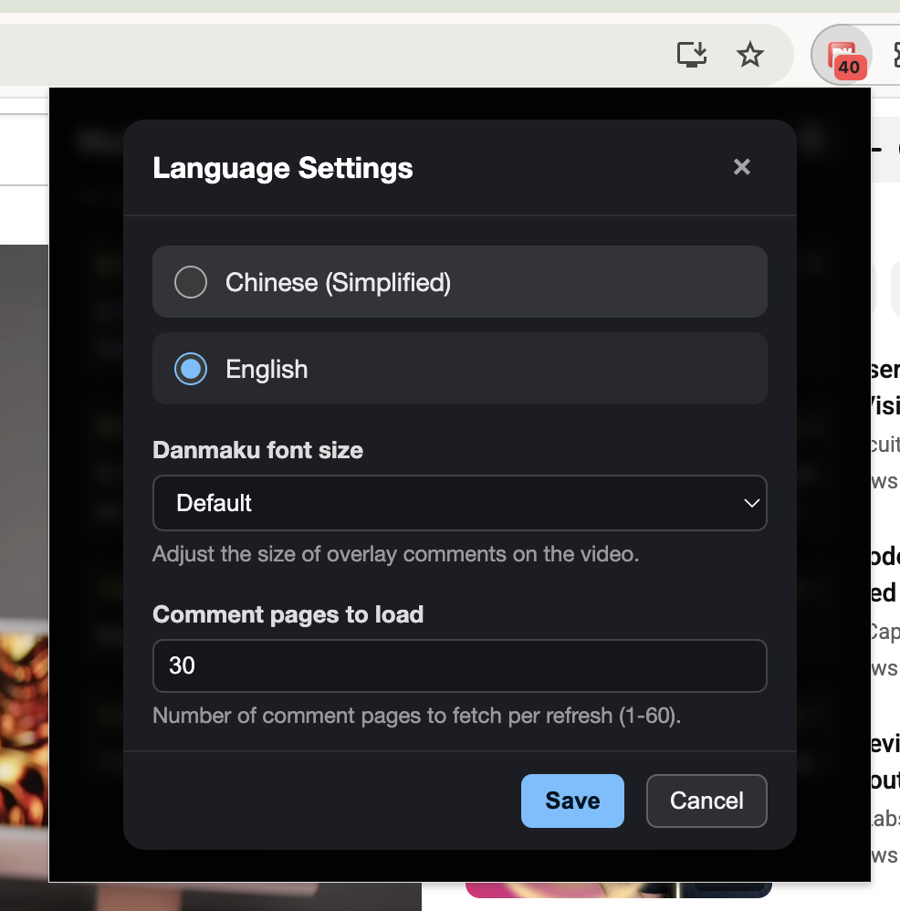

# MyZ Danmaku – User Guide

This page walks through the basics of MyZ Danmaku, a Chrome extension that converts time-coded YouTube comments into overlay danmaku. Follow the steps below to install the extension, verify that it is active, and tweak the viewing experience.

## Installation

Install the extension from your browser’s add-on store:

- Chrome: <https://chromewebstore.google.com/detail/ignagkboleblnlgpadmpjpccocgpghpa>
- Edge: <https://microsoftedge.microsoft.com/addons/detail/lmeklchkknhmflgjdpemkgdgaceihimk>

## Getting started

Once installed, MyZ Danmaku runs automatically—there is nothing to toggle on. Open any YouTube `watch` page and the extension will begin parsing comments that contain timestamps.

1. **Check the player UI** – a button labeled “弹” appears in the control bar. When comments are successfully parsed, the YouTube progress bar also shows timeline markers that indicate when danmaku will appear.
2. **Watch the overlay** – every recognized timestamped comment is converted into a danmaku line that scrolls across the upper half of the video.

You can pin the extension to the Chrome toolbar from the extension menu. The badge displays how many danmaku entries were found for the current video, and clicking the icon opens the popup with the full list plus a manual refresh button.

This is the popup page:

## Preferences

Open the settings button inside the popup to fine-tune the experience:

- **Interface language** – switch between English and Simplified Chinese.
- **Danmaku font size** – scale the overlay text so that it stays readable on different screens.
- **Comment pages to load** – choose how many comment pages (1–60) are fetched per refresh. Higher numbers capture more timestamped comments but take longer to load.

Enjoy your YouTube sessions with synchronized danmaku! If you encounter any issues, please reach out via the support links inside the popup.
